# 🗺️ KastaRehber - AI-Powered Smart Tourism Guide

KastaRehber is a native Android mobile application designed to optimize travel experiences for tourists visiting Kastamonu. By analyzing dynamic user constraints, the system generates efficient linear itineraries while providing an asynchronous academic AI chatbot assistant tailored to the city's rich historical and cultural heritage.

---

## 📸 Mobile Application Walkthrough (UI/UX)

### 🔐 Authentication & Onboarding
<table>
  <tr>
    <td><b>Splash Screen</b></td>
    <td><b>Sign In Screen</b></td>
    <td><b>Sign Up Screen</b></td>
  </tr>
  <tr>
    <td></td>
    <td>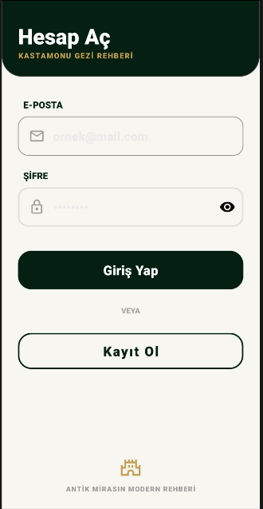</td>
    <td>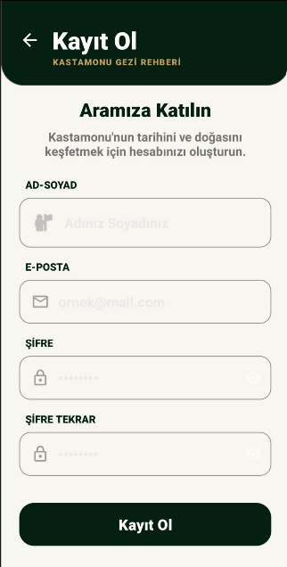</td>
  </tr>
</table>

### 🧙‍♂️ Smart Planning Wizard Steps
<table>
  <tr>
    <td><b>1. Duration Selection</b></td>
    <td><b>2. Budget Allocation</b></td>
    <td><b>3. Category Interests</b></td>
    <td><b>4. Companion Configuration</b></td>
  </tr>
  <tr>
    <td>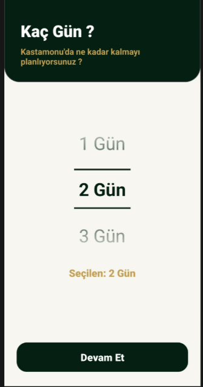</td>
    <td>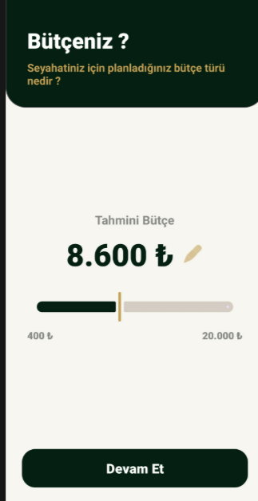</td>
    <td>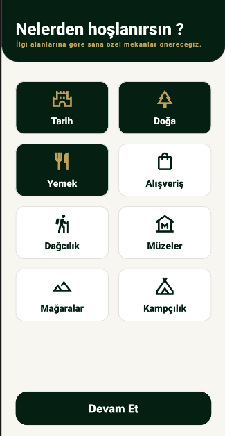</td>
    <td>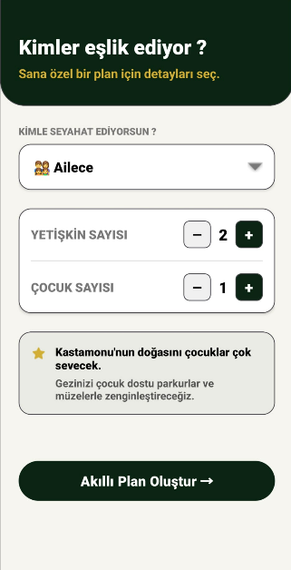</td>
  </tr>
</table>

### 🏛️ Main Application Core Features
<table>
  <tr>
    <td><b>Explore Destinations</b></td>
    <td><b>AI Guide Chatbot</b></td>
    <td><b>Saved Favorites</b></td>
    <td><b>User Profile</b></td>
  </tr>
  <tr>
    <td>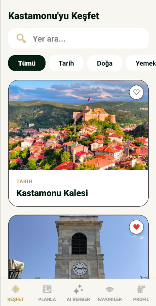</td>
    <td>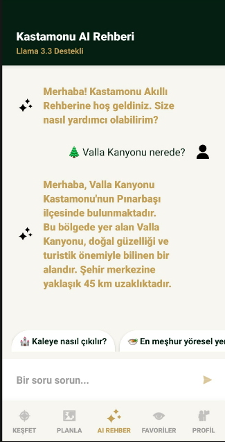</td>
    <td>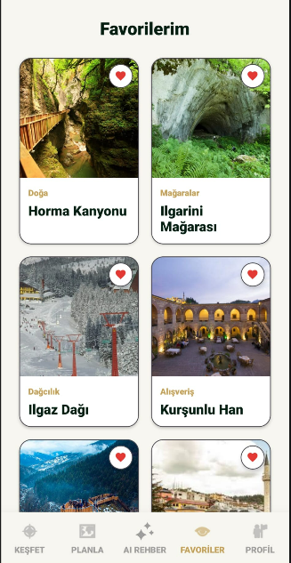</td>
    <td>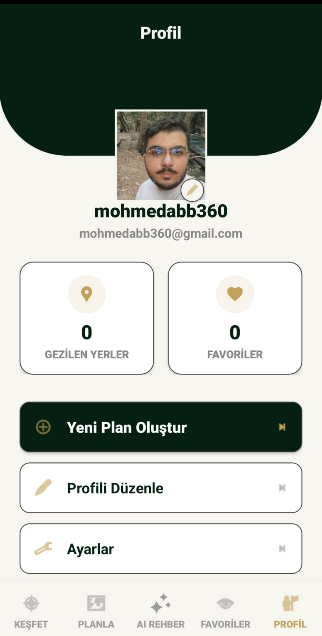</td>
  </tr>
</table>

### 🗺️ Optimized Route & Map Engine
<table>
  <tr>
    <td><b>Google Maps Linear Itinerary Tracker</b></td>
  </tr>
  <tr>
    <td>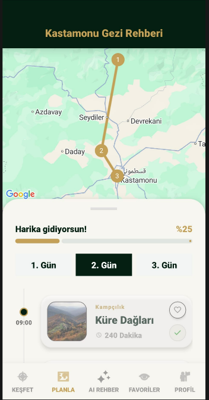</td>
  </tr>
</table>

---

## 🚀 Key Features

* **Smart Planning Wizard:** Synthesizes dynamic user constraints such as budget limits, total days of stay, and social group types to generate optimized travel itineraries.
* **Haversine Route Optimization:** Computes the geospatial distance between locations using coordinates (Latitude/Longitude) to sequence places in the most efficient physical order, preventing time loss.
* **Llama 3.3 AI Chatbot Assistant:** Integrates Meta's Llama 3.3 (70B) model via Groq API. Utilizes advanced System Prompt Engineering to deliver precise, hallucination-free, and context-bounded responses regarding Kastamonu.
* **Secure Cloud Infrastructure:** Powered by Google Firebase. Leverages Cloud Firestore (NoSQL) for real-time synchronization and offline persistence, alongside Firebase Authentication for encrypted user session management.
* **Asynchronous Thread Management:** Offloads heavy network and LLM API workloads to background worker threads (`ExecutorService`), preserving a smooth 60 FPS fluid rendering on the Main UI Thread.

---

## 🛠️ Architecture & Tech Stack

* **Platform & Language:** Android Studio | Java (Native OOP Framework)
* **Cloud Database & Security:** Firebase Cloud Firestore & Firebase Authentication
* **Artificial Intelligence Core:** Groq API Service (Meta Llama 3.3 Inference Engine)
* **Networking & Data Parsing:** OkHttpClient Framework & JSON Data Deserialization
* **UI/UX Framework:** Material Design 3 Components, Responsive XML Layouts & ConstraintLayout

---

## 📁 Project Directory Structure

```text
com.turizm.kastarehber/
│
├── activities/     # Manages application lifecycle (Splash, Login, Register, MainActivity)
├── fragments/      # Modular layout controllers (Dashboard, Explore, AI Chatbot, Settings)
├── model/          # NoSQL Data Models mapped to Firestore (Location, User, Itinerary)
├── services/       # Handles background cloud synchronization and data push streams
└── utils/          # Core algorithms (Haversine Optimizer, Route Engine, Groq API Handlers)

🏆 Database Architecture (Firebase Firestore)
📁 Android Project Structure (Development Output)
👷 Developer & Academic Framework
Lead Developer: MOHAMMAD ALSULIBI (Student ID: 224410131)

Institution: Kastamonu University

Faculty: Faculty of Engineering and Architecture | Department of Computer Engineering

Project Advisor: Dr. Öğr. Üyesi Ali Burak ÖNCÜL
